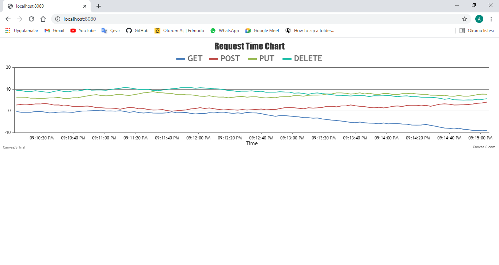

# KARTACA-INTERN-TASK
***Ahmet Yakup Çetinkaya***
- Görev içeriği kartaca.docx dosyasında mevcuttur.  
- Görev dosyalarının text formatına dönüştürülmesi python ile yapılmıştır.
- Datalar text.log dosyasında tutulmaktadır.
### Anahtar Kodu
gAAAAABgUIUosE9BbcNBJNQXtEpGOIalpcuHOaxHj1B-RAARxhGABqtApjnunm2pU9HQszdooCACclvG0vZr39T2xZ_R8naPQaRBPJPOMeG9sXUe03paByk20t53wOzBN6ObK7b4ygnh5DTLoW5aYKZPsIsnZJxNXmDAYLThs43xB_SigosEQ97VQ63bMshjRJTeYGTva88OlRpJgEI0dlr1762mV357WA==

### Kullanılan Teknolojiler
- Java Spring Boot  
- Mongodb  
- Docker-Compose  
- Kafka

### Endpoins
- **Get**: 
  - localhost:8080/get  
- **Post**: 
  - localhost:8080/post  
- **Put**: 
  - localhost:8080/put  
- **Delete**: 
  - localhost:8080/delete

### Çalıştırma
- Docker'ı çalıştırın.
- Terminale *docker-compose up* yazın.  
- Spring boot projesini ayağa kaldırın.  
- İlgili endpointlere istek atıldığında çıktı veritabanına yazılmaktadır.  

### Notlar
Son 1 saatteki verilerin grafik oluşturulmasını görev süresi içinde tamamlayamadım.  
Ancak spring boot thymeleaf eklentisi ile statik bir arayüz oluşturabildim.  
Grafik template/index.html dosyası içindedir.  
Grafiğin çalıştırılabilmesi için Controller içine gerilerek @RestController anotasyonu yerine @Controller anotasyonu eklenmelidir.  
Sonrasında localhost:8080 adresine istek atılarak grafik görüntülenebilir.

